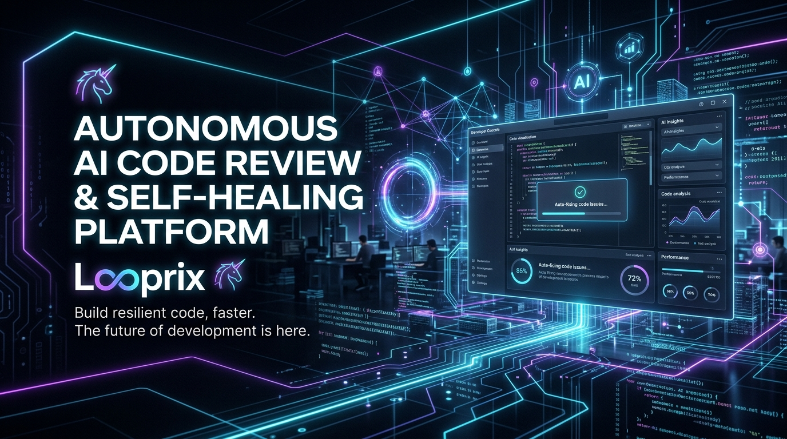
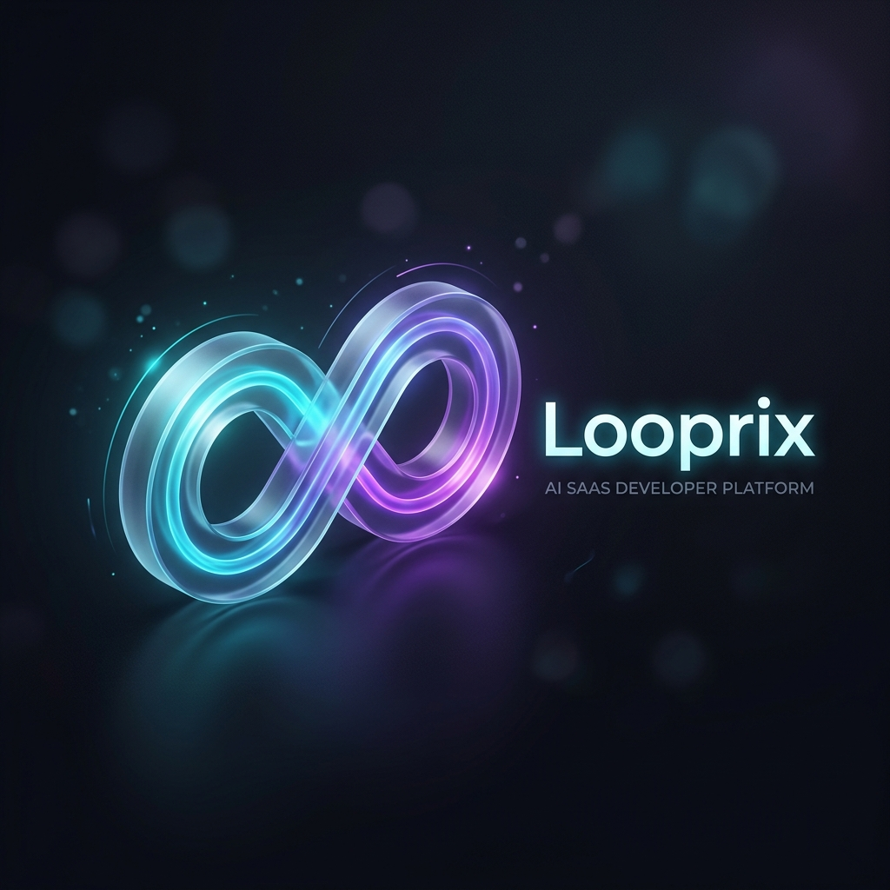
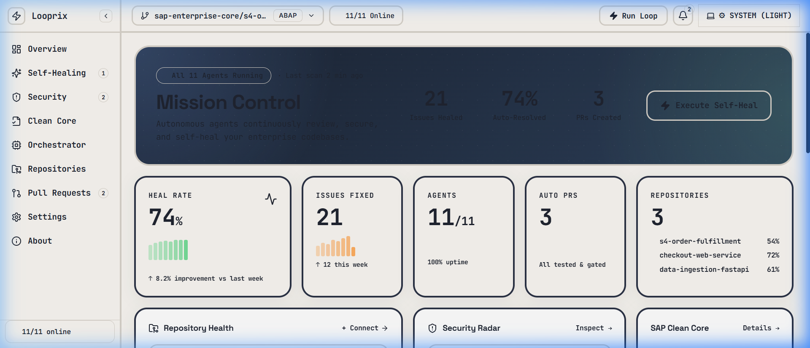
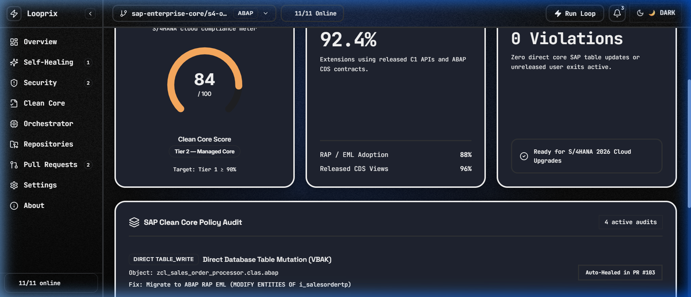

<div align="center">
  
</div>

<br />

#  Looprix Project Structure & Architecture

**Single Source of Truth** for the Looprix project. This document covers all architecture, data flows, components, and integration details.

---

## Overview

Looprix is an Autonomous Code Review & Self-Healing Developer Platform designed to secure, optimize, and remediate enterprise codebases. It features three core capabilities:

1. **Feature 1 — Autonomous Self-Healing**: Detects code smells, security vulnerabilities (OWASP Top 10), and non-compliant patterns (SAP Clean Core) across ABAP, TypeScript, and Python. The system drafts patches, generates unit tests (achieving >80% coverage), and opens validated pull requests.
2. **Feature 2 — Multi-Agent Orchestration**: Built on the Antigravity Agent Framework 2.0, utilizing a loop of specialized AI agents (Triage, Security, Clean Core, Performance, Refactoring, Test, and Validation) running in a 5-iteration retry cycle.
3. **Feature 3 — Real-Time Developer Dashboard**: A centralized, modern interface (Vite + React) that provides executives and engineers with live insights, clean core scores, agent memory streams, and 1-click merge approvals for AI-generated pull requests.

---

### UI Screenshots

<div align="center">
  
  
</div>

---

## Tech Stack

| Layer | Technology |
|---|---|
| **Backend / Services** | Python FastAPI, Celery, Redis, PostgreSQL (planned/mocked via UI state) |
| **Frontend Framework** | React 18, Vite 6, Tailwind CSS 3.4, TypeScript 5.7 |
| **UI Components** | Custom Glassmorphism System, Lucide React, Canvas-based Interactive Backgrounds |
| **AI Orchestration** | Antigravity Agent Framework 2.0 |
| **LLM Layer** | OpenAI GPT-5, Anthropic Claude 3.7 Sonnet, Azure OpenAI |
| **External Integrations** | GitHub API, GitLab, Azure DevOps, SAP S/4HANA (Extensibility API) |

## Architecture Diagram

```
┌─────────────────────────────────────────────────────────────────────────────┐
│                              FRONTEND (React + Vite)                       │
│  ┌─────────┐  ┌─────────┐  ┌───────────┐  ┌─────────┐  ┌──────────────┐  │
│  │Overview │  │ Studio  │  │Pull Reqs  │  │ Security│  │ Clean Core   │  │
│  │  /      │  │ /studio │  │/pull-reqs │  │/security│  │/compliance   │  │
│  └────┬────┘  └────┬────┘  └─────┬─────┘  └────┬────┘  └──────┬───────┘  │
│       └────────────┼─────────────┼─────────────┼──────────────┘          │
│                    │             │             │                         │
│                    ▼             ▼             ▼                         │
│             React Context (AppContext) + Shared Memory Stream            │
└────────────────────────────────────┬──────────────────────────────────────┘
                                     │
                                     ▼
┌─────────────────────────────────────────────────────────────────────────────┐
│                          BACKEND & AI LAYER                                 │
│                                                                             │
│  ┌──────────────────────────────────────────────────────────┐             │
│  │           Antigravity Agent Framework 2.0                │             │
│  │  ┌─────────────────┐  ┌─────────────────────────────┐    │             │
│  │  │ Agent Orchestrator │  │ Shared Memory Context Bus   │    │             │
│  │  └─────────────────┘  └─────────────────────────────┘    │             │
│  └─────────────────────────────┬────────────────────────────┘             │
│                                │                                          │
│  ┌────────────────────┐  ┌─────▼──────────────┐  ┌─────────────────────┐  │
│  │    AI Agents       │  │   Validation Loop  │  │   External APIs     │  │
│  │  ┌──────────────┐  │  │  ┌──────────────┐  │  │  GitHub API         │  │
│  │  │  Security    │  │  │  │ Unit Testing │  │  │  GitLab API         │  │
│  │  │  Clean Core  │  │  │  │ (Coverage)   │  │  │  SAP S/4HANA        │  │
│  │  │  Performance │  │  │  └──────┬───────┘  │  │                     │  │
│  │  │  Refactoring │  │  │  ┌──────▼───────┐  │  │                     │  │
│  │  │  Self-Healing│  │  │  │ Quality Gate │  │  │                     │  │
│  │  └──────────────┘  │  │  └──────────────┘  │  │                     │  │
│  └────────────────────┘  └────────────────────┘  └─────────────────────┘  │
└─────────────────────────────────────────────────────────────────────────────┘
```

## Directory Structure

```
looprix/
├── src/                              # React application root
│   ├── components/                   # React UI Components
│   │   ├── common/                   # Shared UI primitives (Buttons, Cards, Badges)
│   │   ├── dashboard/                # Domain-specific pages and views
│   │   │   ├── OverviewView.tsx      # Executive dashboard with hero & metrics
│   │   │   ├── AgentStudioView.tsx   # Live view of Antigravity memory bus
│   │   │   ├── SecurityDashboard.tsx # Vulnerability inspector
│   │   │   ├── PullRequestsView.tsx  # Kanban/List view of AI-generated PRs
│   │   │   └── AboutView.tsx         # Application info and author details
│   │   ├── layout/                   # Application shell components
│   │   │   ├── Header.tsx            # Top navigation bar
│   │   │   └── Sidebar.tsx           # Collapsible side navigation
│   │   ├── theme/                    # Theme management components
│   │   │   └── theme-provider.tsx    # Dark/Light mode context provider
│   │   └── ui/                       # Highly reusable interactive primitives
│   │       ├── noise-dark-blue-gradient-with-squares.tsx # Canvas background
│   │       └── demo.tsx
│   ├── context/                      # React Context providers
│   │   └── AppContext.tsx            # Global state (Tickets, Memory, PRs, Nav)
│   ├── data/                         # Mock data / initial state seeds
│   │   └── mockData.ts               # Sample repos, PRs, and AI findings
│   ├── hooks/                        # Custom React hooks
│   ├── styles/                       # Global CSS and Tailwind directives
│   │   └── theme.css                 # CSS variables, premium ink system, and tokens
│   ├── types/                        # TypeScript interfaces and type definitions
│   │   └── index.ts                  # Core models (PullRequest, SecurityFinding)
│   ├── App.tsx                       # Main application layout and router
│   └── main.tsx                      # Vite React entry point
├── public/                           # Static assets
├── tailwind.config.js                # Tailwind CSS configuration and theme tokens
├── postcss.config.js                 # PostCSS configuration
├── vite.config.ts                    # Vite bundler configuration
├── package.json                      # NPM dependencies and scripts
└── README.md                         # Project documentation
```

---

## Agent Pipeline Architecture

Looprix relies on an 11-module multi-agent pipeline orchestrated by the Antigravity Agent Framework.

### Orchestration Path

```
Issue Found ➔ Reasoning ➔ Fix Generated ➔ Tests Synthesized ➔ Validation Gate ➔ Pull Request Opened
```

1. **Detection**: `Security Agent` and `Clean Core Agent` scan ingested repositories for OWASP Top 10 vulnerabilities or SAP extensibility violations.
2. **Patch Generation**: `Self-Healing Agent` synthesizes semantic fixes.
3. **Verification**: `Unit Test Agent` generates PyTest/Jest/ABAP Unit tests to ensure the patch does not break existing logic.
4. **Validation Gate**: `Validation Agent` ensures minimum thresholds (80% coverage, 0 critical issues). If it fails, the loop restarts (up to 5 times).
5. **Execution**: `Pull Request Agent` autonomously opens a GitHub/GitLab PR with an attached risk summary and testing manifest.

---

## Data Models

### PullRequest (`src/types/index.ts`)

Represents an AI-generated Pull Request waiting for human review.

| Field | Type | Description |
|---|---|---|
| `id` | `string` | Unique identifier |
| `repoId` | `string` | Associated repository ID |
| `title` | `string` | AI-generated PR title |
| `description` | `string` | Detailed PR body and reasoning |
| `status` | `'open' \| 'merged' \| 'closed'` | PR lifecycle state |
| `healthScore` | `number` | Confidence/Quality score (0-100) |
| `securitySummary` | `object` | `{ vulnerabilitiesFound, resolvedIssues, severity }` |
| `coverage` | `object` | `{ previous, new }` test coverage percentages |
| `createdAt` | `string` | Timestamp |

### SecurityFinding (`src/types/index.ts`)

Represents a vulnerability or code smell detected by an agent.

| Field | Type | Description |
|---|---|---|
| `id` | `string` | Unique identifier |
| `type` | `string` | OWASP category or Clean Core rule |
| `severity` | `'critical' \| 'high' \| 'medium' \| 'low'` | Finding severity |
| `file` | `string` | File path |
| `line` | `number` | Line number of the issue |
| `description` | `string` | Explanation of the vulnerability |
| `aiRemediation` | `string` | AI's proposed solution strategy |

---

## Configuration & Customization

### Theming System (`src/styles/theme.css`)

Looprix uses a custom "Premium Ink System" to avoid stark, neo-brutalist blacks and whites.
The CSS variables handle live toggling between light and dark modes:

- `--background`, `--foreground`: Core app background and text.
- `--ink-primary`, `--ink-secondary`, `--ink-muted`: Semantic dark mode depths.
- `--hero-bg`, `--hero-title`: Special tokens for dynamic gradients and spotlight elements.

### Adding New Views

Views are rendered dynamically in `App.tsx` based on the active tab state stored in `AppContext.tsx`.

1. **Create the View component**: `src/components/dashboard/NewView.tsx`
2. **Add to `NavTab` Type**: Edit `NavTab` in `AppContext.tsx`.
3. **Register in Sidebar**: Add a configuration object to the `NAV` array in `src/components/layout/Sidebar.tsx`.
4. **Render in Router**: Add a `case` statement to `renderActiveView()` in `App.tsx`.

---

## Development

```bash
# Clone the repository
git clone https://github.com/Priyadharshan2003/looprix.git
cd looprix

# Install dependencies
npm install

# Start the local development server (Vite)
npm run dev
# The application will launch on http://localhost:5173

# Build for production
npm run build
npm run preview
```

---

## 🤝 Contributing

We welcome contributions from the community! Whether it's adding new agent modules, expanding language support, or improving the UI, your help makes Looprix better.

1. **Fork the repository**
2. **Create your feature branch** (`git checkout -b feature/AmazingFeature`)
3. **Commit your changes** (`git commit -m 'Add some AmazingFeature'`)
4. **Push to the branch** (`git push origin feature/AmazingFeature`)
5. **Open a Pull Request**

Please read our [CONTRIBUTING.md](CONTRIBUTING.md) for details on our code of conduct, and the process for submitting pull requests to us.

---

## 💖 Sponsor & Support

If Looprix has helped your engineering team save time, prevent vulnerabilities, or maintain clean core compliance, consider supporting the project!

- ⭐ **Star this repository** to help others find it.
- 🐛 **Report issues** to help us improve.
- 💡 **Suggest features** in the discussions tab.

---

## 👨‍💻 About the Author

**Looprix** was created and is actively maintained by:

**Priyadharshan Chandranath**  
*Senior Analyst & SAP Product Engineer*  

📬 **Contact & Connect:**  
- [Portfolio & Website](https://priyadharshan-tau.vercel.app/)
- Have a feature request or need enterprise support? Feel free to reach out through my portfolio.

---

## 📜 License

Distributed under the MIT License. See [LICENSE](LICENSE) for details.
